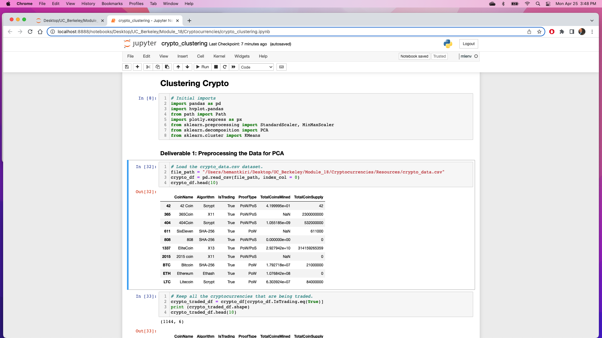
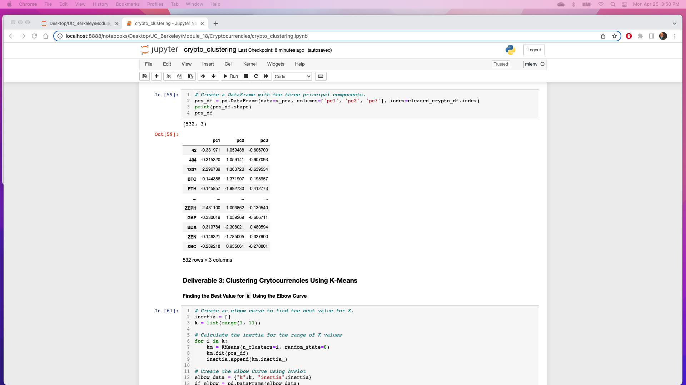
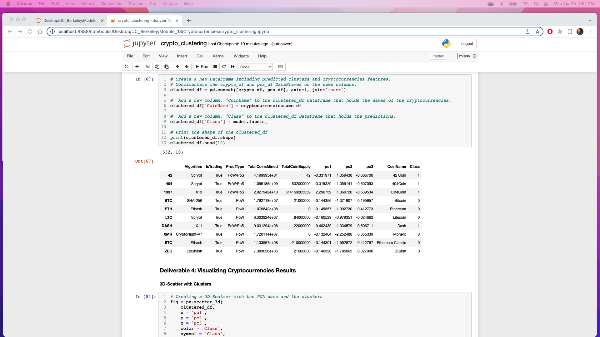
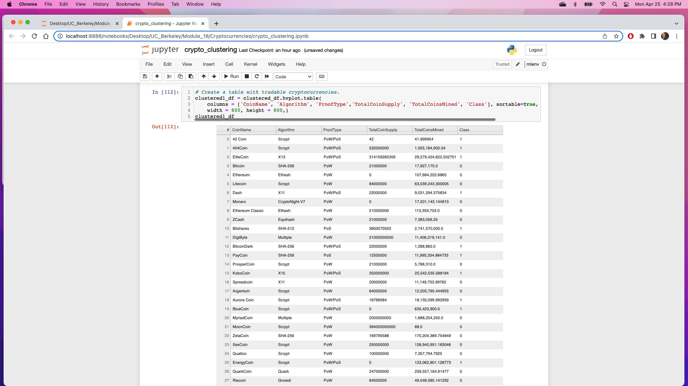
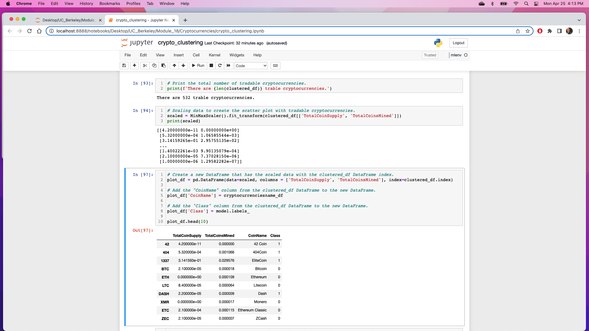
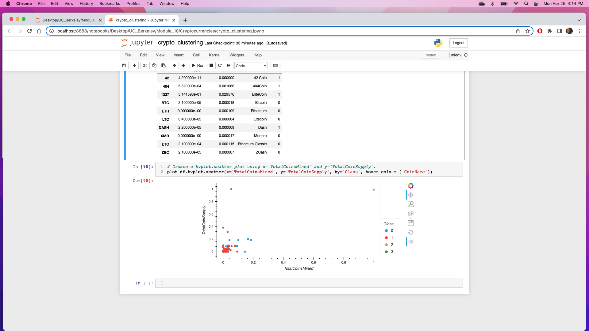

# Cryptocurrencies

## Overview of Project
The purpose of this project is to dive deeper into machine learning using unsupervised algorithms, which help to explore data when we’re not sure what we’re looking for.

## Resources:
Data: Crypto_data.csv
Technology: Jupyter Notebook, Python, Pandas, Plotly, hvPlot, K-means Algorithm, Elbow Curve,..

## Results
## Deliverable 1: Preprocessing the Data for PCA 
crypto_df

## Deliverable 2: Reducing Data Dimensions Using PCA
pcs_df

## Deliverable 3: Clustering Cryptocurrencies Using K-means 
clustered_df

## Deliverable 4: Visualizing Cryptocurrencies Results

hvplot.table

clustered_df

scatter plot 

